<!--

title: "First steps with Zotero"  

author: Damien Belvèze

date: january 2025

email: damien.belveze@univ-rennes.fr 

attribute: [First steps with Zotero](https://liascript.github.io/course/?https://raw.githubusercontent.com/damienbelveze/CFCB_IA/main/deroule_cours.md#1) 
        by [Damien Belvèze](damien.belveze@univ-rennes.fr) 
        is licensed under [CC-by-sa](https://creativecommons.org/licenses/by-sa/4.0/?ref=chooser-v1)

language: fr 

link: lia.css

icon: ./images/etoile.png

comment: this guide is adapted to PhD students who discover the free reference manager Zotero. Much of its content comes from the Zotero workshop libguide published by Formadoct and archived on [Internet Archive](https://web.archive.org/web/20210622005132/https://formadoct.doctorat-bretagneloire.fr/zotero_workshop/introduction)

import: https://raw.githubusercontent.com/LiaTemplates/citations/main/README.md

@onload
// this shall load an entire file at starttime that can be referenced
setTimeout(() => { window.bibliographyLoad("https://raw.githubusercontent.com/LiaTemplates/citations/main/bibtex.bib")}, 100)
@end

-->

# First steps with Zotero

```ascii

          _____                   _____                   _____                   _____            _____                            _____            _____                   _____                   _____                   _____                  
         /\    \                 /\    \                 /\    \                 /\    \          /\    \                          /\    \          /\    \                 /\    \                 /\    \                 /\    \                 
        /::\    \               /::\    \               /::\    \               /::\    \        /::\    \                        /::\    \        /::\    \               /::\    \               /::\    \               /::\    \                
       /::::\    \              \:::\    \             /::::\    \             /::::\    \       \:::\    \                      /::::\    \       \:::\    \             /::::\    \             /::::\    \             /::::\    \               
      /::::::\    \              \:::\    \           /::::::\    \           /::::::\    \       \:::\    \                    /::::::\    \       \:::\    \           /::::::\    \           /::::::\    \           /::::::\    \              
     /:::/\:::\    \              \:::\    \         /:::/\:::\    \         /:::/\:::\    \       \:::\    \                  /:::/\:::\    \       \:::\    \         /:::/\:::\    \         /:::/\:::\    \         /:::/\:::\    \             
    /:::/__\:::\    \              \:::\    \       /:::/__\:::\    \       /:::/__\:::\    \       \:::\    \                /:::/__\:::\    \       \:::\    \       /:::/__\:::\    \       /:::/__\:::\    \       /:::/__\:::\    \            
   /::::\   \:::\    \             /::::\    \     /::::\   \:::\    \      \:::\   \:::\    \      /::::\    \               \:::\   \:::\    \      /::::\    \     /::::\   \:::\    \     /::::\   \:::\    \      \:::\   \:::\    \           
  /::::::\   \:::\    \   ____    /::::::\    \   /::::::\   \:::\    \      \:::\   \:::\    \    /::::::\    \               \:::\   \:::\    \    /::::::\    \   /::::::\   \:::\    \   /::::::\   \:::\    \   ___\:::\   \:::\    \          
 /:::/\:::\   \:::\    \ /\   \  /:::/\:::\    \ /:::/\:::\   \:::\____\ /\   \:::\   \:::\    \  /:::/\:::\    \          /\   \:::\   \:::\    \  /:::/\:::\    \ /:::/\:::\   \:::\    \ /:::/\:::\   \:::\____\ /\   \:::\   \:::\    \         
/:::/  \:::\   \:::\____/::\   \/:::/  \:::\____/:::/  \:::\   \:::|    /::\   \:::\   \:::\____\/:::/  \:::\____\        /::\   \:::\   \:::\____\/:::/  \:::\____/:::/__\:::\   \:::\____/:::/  \:::\   \:::|    /::\   \:::\   \:::\____\        
\::/    \:::\   \::/    \:::\  /:::/    \::/    \::/   |::::\  /:::|____\:::\   \:::\   \::/    /:::/    \::/    /        \:::\   \:::\   \::/    /:::/    \::/    \:::\   \:::\   \::/    \::/    \:::\  /:::|____\:::\   \:::\   \::/    /        
 \/____/ \:::\   \/____/ \:::\/:::/    / \/____/ \/____|:::::\/:::/    / \:::\   \:::\   \/____/:::/    / \/____/          \:::\   \:::\   \/____/:::/    / \/____/ \:::\   \:::\   \/____/ \/_____/\:::\/:::/    / \:::\   \:::\   \/____/         
          \:::\    \      \::::::/    /                |:::::::::/    /   \:::\   \:::\    \  /:::/    /                    \:::\   \:::\    \  /:::/    /           \:::\   \:::\    \              \::::::/    /   \:::\   \:::\    \             
           \:::\____\      \::::/____/                 |::|\::::/    /     \:::\   \:::\____\/:::/    /                      \:::\   \:::\____\/:::/    /             \:::\   \:::\____\              \::::/    /     \:::\   \:::\____\            
            \::/    /       \:::\    \                 |::| \::/____/       \:::\  /:::/    /\::/    /                        \:::\  /:::/    /\::/    /               \:::\   \::/    /               \::/____/       \:::\  /:::/    /            
             \/____/         \:::\    \                |::|  ~|              \:::\/:::/    /  \/____/                          \:::\/:::/    /  \/____/                 \:::\   \/____/                 ~~              \:::\/:::/    /             
                              \:::\    \               |::|   |               \::::::/    /                                     \::::::/    /                            \:::\    \                                      \::::::/    /              
                               \:::\____\              \::|   |                \::::/    /                                       \::::/    /                              \:::\____\                                      \::::/    /               
                                \::/    /               \:|   |                 \::/    /                                         \::/    /                                \::/    /                                       \::/    /                
          _____                  \_____/           _____ \|___|            _____ \/____/                    _____                  _______          _____                   ______/                 _____                  _______/                 
         /\    \                 /\    \          /\    \                 /\    \                          /\    \                /::\    \        /\    \                 /\    \                 /\    \                /::\    \                 
        /::\____\               /::\    \        /::\    \               /::\____\                        /::\    \              /::::\    \      /::\    \               /::\    \               /::\    \              /::::\    \                
       /:::/    /               \:::\    \       \:::\    \             /:::/    /                        \:::\    \            /::::::\    \     \:::\    \             /::::\    \             /::::\    \            /::::::\    \               
      /:::/   _/___              \:::\    \       \:::\    \           /:::/    /                          \:::\    \          /::::::::\    \     \:::\    \           /::::::\    \           /::::::\    \          /::::::::\    \              
     /:::/   /\    \              \:::\    \       \:::\    \         /:::/    /                            \:::\    \        /:::/~~\:::\    \     \:::\    \         /:::/\:::\    \         /:::/\:::\    \        /:::/~ \:::\    \             
    /:::/   /::\____\              \:::\    \       \:::\    \       /:::/____/                              \:::\    \      /:::/    \:::\    \     \:::\    \       /:::/  \:::\    \       /:::/  \:::\    \      /:::/    \:::\    \            
   /:::/   /:::/    /              /::::\    \      /::::\    \     /::::\    \                               \:::\    \    /:::/    / \:::\    \    /::::\    \     /::::\   \:::\    \     /::::\   \:::\    \    /:::/    / \:::\    \           
  /:::/   /:::/   _/___   ____    /::::::\    \    /::::::\    \   /::::::\    \   _____                       \:::\    \  /:::/____/   \:::\____\  /::::::\    \   /::::::\   \:::\    \   /::::::\   \:::\    \  /:::/____/   \:::\____\          
 /:::/___/:::/   /\    \ /\   \  /:::/\:::\    \  /:::/\:::\    \ /:::/\:::\    \ /\    \                       \:::\    \|:::|    |     |:::|    |/:::/\:::\    \ /:::/\:::\   \:::\    \ /:::/\:::\   \:::\____\|:::|    |     |:::|    |         
|:::|   /:::/   /::\____/::\   \/:::/  \:::\____\/:::/  \:::\____/:::/  \:::\    /::\____\        _______________\:::\____|:::|____|     |:::|    /:::/  \:::\____/:::/__\:::\   \:::\____/:::/  \:::\   \:::|    |:::|____|     |:::|    |         
|:::|__/:::/   /:::/    \:::\  /:::/    \::/    /:::/    \::/    \::/    \:::\  /:::/    /        \::::::::::::::::::/    /\:::\    \   /:::/    /:::/    \::/    \:::\   \:::\   \::/    \::/   |::::\  /:::|____|\:::\    \   /:::/    /          
 \:::\/:::/   /:::/    / \:::\/:::/    / \/____/:::/    / \/____/ \/____/ \:::\/:::/    /          \::::::::::::::::/____/  \:::\    \ /:::/    /:::/    / \/____/ \:::\   \:::\   \/____/ \/____|:::::\/:::/    /  \:::\    \ /:::/    /           
  \::::::/   /:::/    /   \::::::/    /       /:::/    /                   \::::::/    /            \:::\~~~~\~~~~~~         \:::\    /:::/    /:::/    /           \:::\   \:::\    \           |:::::::::/    /    \:::\    /:::/    /            
   \::::/___/:::/    /     \::::/____/       /:::/    /                     \::::/    /              \:::\    \               \:::\__/:::/    /:::/    /             \:::\   \:::\____\          |::|\::::/    /      \:::\__/:::/    /             
    \:::\__/:::/    /       \:::\    \       \::/    /                      /:::/    /                \:::\    \               \::::::::/    /\::/    /               \:::\   \::/    /          |::| \::/____/        \::::::::/    /              
     \::::::::/    /         \:::\    \       \/____/                      /:::/    /                  \:::\    \               \::::::/    /  \/____/                 \:::\   \/____/           |::|  ~|               \::::::/    /               
      \::::::/    /           \:::\    \                                  /:::/    /                    \:::\    \               \::::/    /                            \:::\    \               |::|   |                \::::/    /                
       \::::/    /             \:::\____\                                /:::/    /                      \:::\____\               \::/____/                              \:::\____\              \::|   |                 \::/____/                 
        \::/____/               \::/    /                                \::/    /                        \::/    /                ~~                                     \::/    /               \:|   |                  ~                       
         ~~                      \/____/                                  \/____/                          \/____/                                                         \/____/                 \|___|                                           
                                                                                                                                                                                                                                                    
```

# 1. What is a reference manager

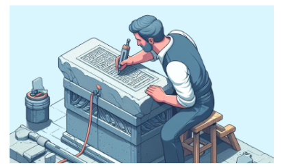


before reference managers exist, writers had to manualy manage their references in their manuscript. It was a very tedious and painful task (and error-prone!)

bibliographic management styling was something that used to be treated just before the milestones were reached. How many difficult nights were spent and lost in putting all references in the right place and in the right format. 

All of this now is 99% supported by this class of software named reference managers. There are several of them. Among the most popular : 

- [Refworks](https://en.wikipedia.org/wiki/RefWorks) (owned by Clarivates through Proquest)  
- [Endnote](https://en.wikipedia.org/wiki/EndNote)(also Clarivate's property and neither free-to-use nor premium)  
- [Mendeley](https://en.wikipedia.org/wiki/Mendeley) (owned by Elsevier, free-to-use) 
- and of course Zotero which is free-to-use but above all *free* [¹]

---
[¹]: [free as in freedom not as "free coffee"](https://sagitter.fedorapeople.org/faif-2.0.pdf)

# 2. Why you should install Zotero rather than another reference manager?

!?[Richard M. Stallman on what does free software mean](gif/stallman.mp4)

If you are member of a school or laboratory which has subscribed to a proprietary software (such as Refworks or Endnote), maybe you have access to one of them. Good for you! But how will you manage your references when you are no longer member of this team?

Don't worry, it is possible to export all your references from Refworks or Endnote and to import them into Zotero. 

From Mendely you just have to export you whole library in a bib or RIS format and to import it in Zotero as it is.

For Endnote and Refworks, we could not test it on our own, but we rely for that on our colleagues from USA : 

- [importing from Refworks](https://libguides.uta.edu/zotero/importing-refworks-data-into-zotero)  

- [importing from Endnote](https://ask.lib.vt.edu/faq/38201)


# 3. How to install Zotero

Installation process is different according to your Operating System (OS)


For which Operating system you need information to install Zotero?

- [ ] Windows
- [ ] MacOS
- [ ] Chromebook
- [ ] GNU\Linux 
- [ ] Android / iOS
<script output="tasks">"@input"</script>

<script style="width: 100%">
try {
  let task = @input(`tasks`)

  if(task[0]) {
    send.liascript(`>## Windows 

go to the download page of the [zotero website](https://zotero.org)
Download 1. the software 2. the plugin for your browser`

    )
  } else send.clear()
} catch(e) { }
</script>


<script style="width: 100%">
try {
  let task = @input(`tasks`)

  if(task[1]) {
    send.liascript(`>## MacOs 

go to the download page of the [zotero website](https://zotero.org)
Zotero client embeds the plugin for Safari (you do not need to load a plugin for Safari). If you prefer to use another browser than Safari (let's say Chrome or Firefox), download and install the appropriate plugin.`

    )
  } else send.clear()
} catch(e) { }
</script>

<script style="width: 100%">
try {
  let task = @input(`tasks`)

  if(task[2]) {
    send.liascript(`>## Chromebook

First you need to activate the Chromebook Linux sub-system (WSL) and then follow the instructions for GNU/Linux operating system` 

    )
  } else send.clear()
} catch(e) { }
</script>

<script style="width: 100%">
try {
  let task = @input(`tasks`)

  if(task[3]) {
    send.liascript(`>## GNU/Linux 

go to the download page of the [zotero website](https://zotero.org)
download the archive (something like Zotero-6.0.35_linux-x86_64.tar.bz2)
move this file to opt/
you will need sudo rights for that. 
go to opt/
*untar* this file : 


>>$ tar -xf Zotero-6.0.9_linux-x86_64.tar.bz2


rename the resulting file : 

>>$ mv Zotero-6.0.9_linux-x86_64 Zotero_linux

*cd* within Zotero_linux


>>$ cd Zotero_linux


at this stage it's already possible to run Zotero (from this place Zotero_linux, with the following command : ./zotero), but obviously it's easier to use a desktop icon. 

Run the launcher icon under Zotero_linux : 

>>$ ./set_launcher_icon

shortcuts are usually located in ~/.local/share/applications/

So we will have to make a symlink (symbolic link) from this place to the place where Zotero is :


>>$ ln -s /opt/Zotero_linux/zotero.desktop ~/.local/share/applications/zotero.desktop

from now you should be able to start Zotero from an icon in your application menu. 
don't forget to install the Zotero plugin in your favorite browser afterwards`

    )
  } else send.clear()
} catch(e) { }
</script>

<script style="width: 100%">
try {
  let task = @input(`tasks`)

  if(task[4]) {
    send.liascript(`>## and on my smartphone?

A Zotero exists in [iOS](https://www.zotero.org/support/ios). 
You may sync your Zotero library with a [beta app](https://play.google.com/store/apps/details?id=org.zotero.android&hl=en-US) designed for Android users as well. 
References may be added manually, via a DOI/ISBN or by scanning a barcode (EAN for books), but in december 2024, it was still impossible to make the Android mobile version work with a browser ([due to a lack of interoperability of Android, according to Zotero developers](https://forums.zotero.org/discussion/comment/480563#Comment_480563))`

    )
  } else send.clear()
} catch(e) { }
</script>

# 4. Why should I create an account to use Zotero

you don't have to to use Zotero localy, but we strongly advise you to create an account.
This will make possible to store your data and PDFs remotely so that: 

- if you use anoter computer, you will be able to retrieve from your library online all the references you need povided you have an internet connection  
- if your computer crash or if you wipe by mistake all the data you have in your Zotero library, this data can still be found and downloaded from your online library
- Online libraries make it possible to work with other users on shared bibliographies

how to create an account? Nothing more easier, go to https://www.zotero.org/ click on login and then register, follow the instructions.
If you have already installed Zotero on your computer, just click on the Sync tab and then login with your new credentials.

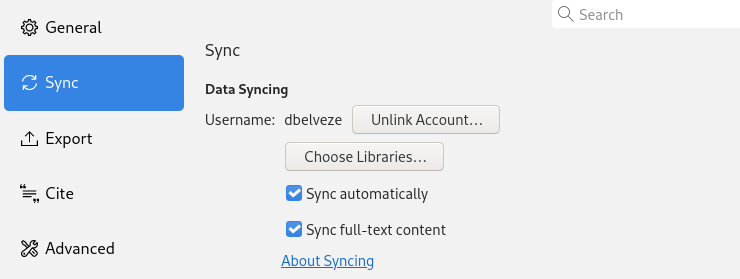

# 5. How does Zotero look like on my laptop

<iframe width="900" height="349" src="https://damienbelveze.github.io/first_steps_zotero/zotero_dashboard.html" frameBorder="0" scrolling="no" styles="width:100%"></iframe>


# 6. collecting bibliographic references

Since iths 6th version, Zotero encapsulates its own PDF viewer making it possible to annotate, comment a PDF or capture and extract figures out of a it.
You are going to collect a PDF document in your Zotero library


>- save [this presentation](https://digitalrepository.unm.edu/cgi/viewcontent.cgi?article=1163&context=hslic-posters-presentations) in your Zotero library   
>- check the reference (compare it with what appears on the titlepage of the document) : what should be amended or completed ?  
>- open the PDF by double clicking on it : highlight some text, write a comment. both actions will have **annotations** as outputs  


In this case, Zotero made a request to Google Scholar and found the link to the parent citation. But sometimes, it won't be possible to retrieve any citation from Scholar or elsewhere. You will need to add it manually!


>- <a href="document.pdf" download>download this document</a>
>- import it (drag and drop it) in your library
>- open it in the PDF viewer
>- create the reference manually (title, author, date)


# 7. How to use tags

Don't wait till your library becomes too big to be easily manageable with only collections and subcollections. In order to improve the findability of your references in your library, you should consider adding tags to your references. 

The default way of getting tags in your library is to let Zotero capture tags associated to the references in the source (database, catalog, etc.). If you prefer to deal only with tags you have chosen, you may inhibit this feature by unchecking a box in the main settings panel.
(go to edit > settings > General ; uncheck "automatically tag items with keywords and subject headiings)
If you let many of these inherited tags populate your collections, you can get rid of them in just one move : 
in the tag panel (bottom-left by clicking on the filter icon and checking the "delete automatic tags in this library" option) : 


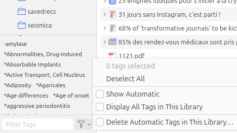

this can be achieved for a specific collection

If you want to tag your references, it can easily be down from the right sidebar:

!?[](gif/add_tags.mp4)

for each reference, you may add as many tags as you want. 
You may assign a specific color to 9 of your tags : this feature is pretty usefull if you need to conduct a literature review from references stored in several collections. 

> add two tags to one of your references and assign a color to each of them

# 8. Let's talk about word processors

Zotero would not be very helpfull if it was not designed to help you insert and manage references within your word processor throughout the process of writing. 
Now, most of word processors are interoperable with Zotero but not all. 
Which one do you usually use? 

- [ ] Word from Microsoft Office
- [ ] LibreOffice
- [ ] OpenOffice
- [ ] Google doc 
- [ ] Pages from Mac
- [ ] Don't bother me with word processors, I use text editors
<script output="tasks">"@input"</script>


<script style="width: 100%">
try {
  let task = @input(`tasks`)

  if(task[0]) {
    send.liascript(`>## Word
    Zotero usually works well with the desktop wersion of Word (for instance Word 2021), but not with Office365. 
    As soon as you have installed Zotero, the Zotero plugin for Word might be added to this word processor. 
    It adds a tab named "Zotero" in the Word menu`
    )
  } else send.clear()
} catch(e) { }
</script>


<script style="width: 100%">
try {
  let task = @input(`tasks`)

  if(task[1]) {
    send.liascript(`>## LibreOffice
    Zotero usually works well with LibreOffice. In some cases, the plugin for LibreOffice won't be automatically installed on Windows because Zotero needs to connect to a Java environment and can find any on the computer.
    To install such an environment, close LibreOffice and Zotero, go to [Oracle website](https://jdk.java.net/) and download the last stable release available. Then reinstall the plugin for LibreOffice from Zotero ( Edit > Settings > Cite)
    Reopen LibreOffice, check that LO is now connected to a Java Environment (JRE, JDK or an equivalent for GNU/Linux OS) : 
     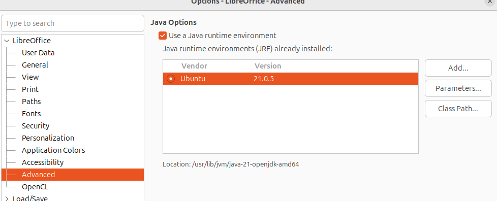. 
    If Java is properly connected to LO, Zotero icons should be visible and active:
    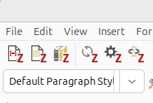
    `
    )
  } else send.clear()
} catch(e) { }
</script>

<script style="width: 100%">
try {
  let task = @input(`tasks`)

  if(task[2]) {
    send.liascript(`>## OpenOffice
    LibreOffice was born of Oracle's takeover of the OpenOffice software (and name). 
    OpenOffice is no longer updated, and is used by Oracle to create confusion with the free software suite born of OpenOffice and renamed LibreOffice in response to resistance from its original developers.
    OpenOffice may not work properly with Zotero, you'd better give up OpenOffice and switch to LibreOffice ([downloadable from here](https://www.libreoffice.org/download/download-libreoffice/))
    `
    )
  } else send.clear()
} catch(e) { }
</script>

<script style="width: 100%">
try {
  let task = @input(`tasks`)

  if(task[3]) {
    send.liascript(`>## Google Doc
    Experienced researchers will tell you that's not a very good idea to write a scientific text on Google Doc. Who knows what Google will make out of text and data you give access them to by using their spreadsheets and word processor?
    But if you are engaged in a collaborative writing project, Google Doc can be usefull though. Zotero references can be inserted in a Google Doc by using Google's Zotero Google Doc Integration app. 
    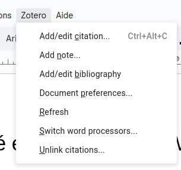
    `
    )
  } else send.clear()
} catch(e) { }
</script>

<script style="width: 100%">
try {
  let task = @input(`tasks`)

  if(task[4]) {
    send.liascript(`>## Pages
    Pages has never been interoperable with Zotero and [is unlikely to work with this reference manager in the future](https://forums.zotero.org/discussion/102457/requesting-for-plugin-for-pages) due to choices made by the Software editor. You may connect Pages to Endnote (if you have an access to EN) but not to Zotero.
    These guys don't like Free Software. You 'd better quit Pages and opt for more transparent and interoperable products such as LibreOffice.
    `
    )
  } else send.clear()
} catch(e) { }
</script>

<script style="width: 100%">
try {
  let task = @input(`tasks`)

  if(task[5]) {
    send.liascript(`>## Don't tell me about word processors, I use a text editor
    Not only we agree, but we value this : using free text editors makes science more reproductible. Besides word processors are distraction prone compared to text editors. See below our section about text editors
    `
    )
  } else send.clear()
} catch(e) { }
</script>

> If you use a word processor that works with Zotero, check that Zotero icons are present and active (something happens iy you click on one of them)

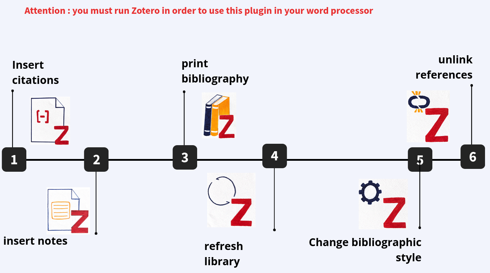

## How to insert a reference

The next activity will be divided in two parts : 

1. save references in Zotero
2. Insert them in a text 

You will be prompted to choose a bibliographic style ; choose the first one listed in the popup.

<a href="insert_references.odt> download">download this text file</a>

> - Create a new collection "word_processor"
> - Find the references listed in the document (1-6) online
> - save them in the *word_processor" collection
> - insert them in the right place in the document
> - print the bibliography at the end of the document

## How to insert a note 

Since Version 6, Zotero allows you to insert notes taken with Zotero editor as well as references

In the word processor editor, select the reference "First Experiences with Reading Primary Literature by Undergraduate Life Science Students"

> using the icons at the top of the PDF viewer, try to reproduce the get this result:

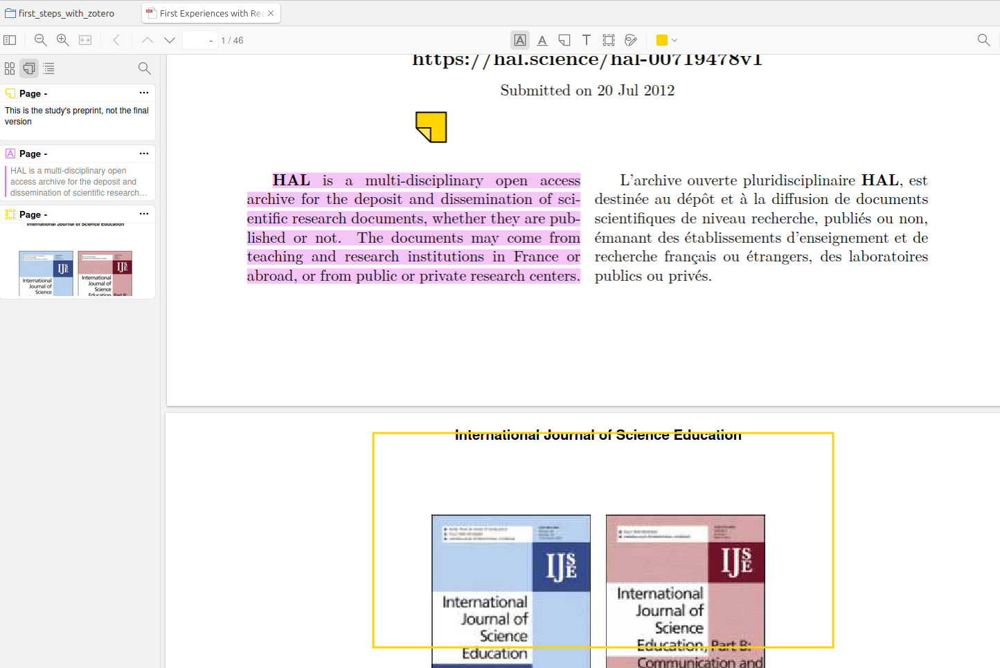

> convert all these "annotations" (left panel) in a single "note" 

to achieve this : right panel > notes > add note from annotations

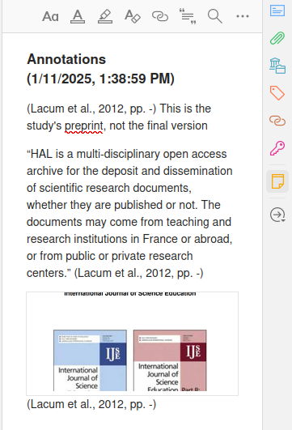

> edit this note in order to add the following paragraph:

```text
"Open archives repositories have been in existence in France since 2001; from 2006, a proactive policy led the main research agencies and universities to coordinate their actions towards a common archiving platform, HAL (Hyper Articles on Line), operated by CNRS (Centre National pour la Recherche Scientifique)"

```
> In this new paragraph, within the note add [the source of this paragraph]((https://onlinelibrary.wiley.com/doi/abs/10.1087/095315107X239636) )

(Collect this reference and add it to the note)

We will now insert our note into our document *insert_refernces.odt". Use the "insert note" button to achieve this. The note should be inserted at the end of the document, before the bibliography

> add this note refresh the bibliography, sync, and view you library online on https://zotero.org (don't forget to login!) 


## How to find your style 


### What is a bibliographic style

In a a bibliography, a reference can be formatted in different ways. 

This is how this reference is formatted in IEEE style (used by journals owned by the IEEE association and beyond by a lot of authors working in the field of informatic science and electronics):

<!-- style="font-size: 40px;" -->
        {{1}}
<div class="csl-bib-body" style="line-height: 1.35; ">
  <div class="csl-entry" style="clear: left; ">
    <div class="csl-left-margin" style="float: left; padding-right: 0.5em;text-align: right; width: 1em;">[1]</div><div class="csl-right-inline" style="margin: 0 .4em 0 1.5em;">H. Allcott and M. Gentzkow, “Social Media and Fake News in the 2016 Election,” <i>Journal of Economic Perspectives</i>, vol. 31, no. 2, pp. 211–236, May 2017, doi: <a href="https://doi.org/10.1257/jep.31.2.211">10.1257/jep.31.2.211</a>.</div>
  </div>
  <span class="Z3988" title="url_ver=Z39.88-2004&amp;ctx_ver=Z39.88-2004&amp;rfr_id=info%3Asid%2Fzotero.org%3A2&amp;rft_id=info%3Adoi%2F10.1257%2Fjep.31.2.211&amp;rft_val_fmt=info%3Aofi%2Ffmt%3Akev%3Amtx%3Ajournal&amp;rft.genre=article&amp;rft.atitle=Social%20Media%20and%20Fake%20News%20in%20the%202016%20Election&amp;rft.jtitle=Journal%20of%20Economic%20Perspectives&amp;rft.stitle=Journal%20of%20Economic%20Perspectives&amp;rft.volume=31&amp;rft.issue=2&amp;rft.aufirst=Hunt&amp;rft.aulast=Allcott&amp;rft.au=Hunt%20Allcott&amp;rft.au=Matthew%20Gentzkow&amp;rft.date=2017-05-01&amp;rft.pages=211-236&amp;rft.spage=211&amp;rft.epage=236&amp;rft.issn=0895-3309&amp;rft.language=en"></span>
</div>
        {{2}}
and this is how it will be formatted in a journal whose guidelines insist on using Chicago Manual of style (17th edition): 

        {{3}}
<!-- style="font-size: 40px;" -->
<div class="csl-bib-body" style="line-height: 1.35; margin-left: 2em; text-indent:-2em;">
  <div class="csl-entry">Allcott, Hunt, and Matthew Gentzkow. 2017. “Social Media and Fake News in the 2016 Election.” <i>Journal of Economic Perspectives</i> 31 (2): 211–36. <a href="https://doi.org/10.1257/jep.31.2.211">https://doi.org/10.1257/jep.31.2.211</a>.</div>
  </div>
  <span class="Z3988" title="url_ver=Z39.88-2004&amp;ctx_ver=Z39.88-2004&amp;rfr_id=info%3Asid%2Fzotero.org%3A2&amp;rft_id=info%3Adoi%2F10.1257%2Fjep.31.2.211&amp;rft_val_fmt=info%3Aofi%2Ffmt%3Akev%3Amtx%3Ajournal&amp;rft.genre=article&amp;rft.atitle=Social%20Media%20and%20Fake%20News%20in%20the%202016%20Election&amp;rft.jtitle=Journal%20of%20Economic%20Perspectives&amp;rft.stitle=Journal%20of%20Economic%20Perspectives&amp;rft.volume=31&amp;rft.issue=2&amp;rft.aufirst=Hunt&amp;rft.aulast=Allcott&amp;rft.au=Hunt%20Allcott&amp;rft.au=Matthew%20Gentzkow&amp;rft.date=2017-05-01&amp;rft.pages=211-236&amp;rft.spage=211&amp;rft.epage=236&amp;rft.issn=0895-3309&amp;rft.language=en"></span>
</div>

### Which style shoud you use

It depends on the context of your work. 

If you are writing a paper, you may choose the style that is mentioned in the author guidelines of the journal in which you would like to publish this paper. Whenever, you submit a paper to a journal, find out which style promotes this journal and format your bibliography accordingly (with Zotero, you just have to reset the preferences of your bibliography, this is quickly done if the style is already available in your styles list)

if not, browse the [zotero style gallery](https://zotero.org/styles) in search of the bibliographic style that is needed and load it into Zotero.
(Settings > Cite > Get additional styles) 

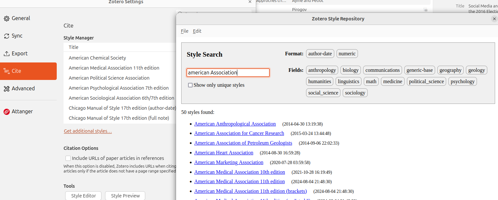

If you are working on your PhD dissertation, ask your supervisor; if they do not know which style to use, choose a standard one (Chicago, APA, MLA for Social and Human Sciences, IEEE, ACM for hard sciences, for example).

More than 3500 styles exist, but if you cannot find the one you need, it's good to know that a bibliographic style is written in CSL (Citation Style Langugage) an XML citation descriptive format. Modifying a style is not trivial but this can be done with some technical skills, and the [citation style editor provided by Elsevier](https://editor.citationstyles.org/visualEditor/) may be of some help if you don't want to dive into the source code.


For example, In the CSL source code part dedicated to the enumeration of bibliographic items, adding the following line : 

```text
<text variable="citation-number" suffix=". "/>
```

adds a . after the item number

9. Adams, D. (2002). The Ultimate Hitchhiker's Guide to the Galaxy (1st ed.)  
10. Asimov, I. (1951). Foundation. 


# 9. Working with partners online

With a free Zotero account, you get access to 300MB storage on Zotero servers. You may use a portion of this space to create group libraries and invite other people to make them grow. 
You might be feel that this free space is limited if you use it to store PDFs or epubs along with references, but if you decide to keep only references, your group library might count several hundreds of items. 

The next activity consists on creating a group library, populate it with one or two documents and invite your neighbour to add one of or two titles that he/she finds inspiring and would recommend (for academic work or for everyday life, as you wish)

>- Go to the Zotero, website and login. 
>- Go to groups
>- create a new group (private membership) and give it a name 
>- synchronize with your computer
>- select this new group library in the groups subsection in your Zotero dashboard
>- add two references of documents that you think worth reading for academic work or every day life 
>- synchronize and go back to your group library online 
>- invite your neighbour to collaborate to this library (you neeed their mail adress to do this)
>- ask your neighbour to accept the invitation, synchronize and add two other references of their choice.

# 10. What about using Zotero with Text Editors?

if you have answered earlier "I use a text editor", this section was written for you. 

A lot of plugins were developed by members of the Zotero community in order to adapt Zotero to their usual workflow (which workflow usually integrates text editor such as  $\LaTeX$ (Texmaker, Texstudio, Overleaf), org-mode or markdown editors (Vim, Emacs, Codium, VSCode, Atom, Obsidian, Zettlr...)). 


## The BetterBibTex plugin

These extensions all rely on a Zotero plugin called [betterbibtex (BBT)](https://retorque.re/zotero-better-bibtex/). This plugin is essential to manage bibtex citations from Zotero collections while writing plain text. 

You will need to install this plugin in your Zotero extension manager to use it. 
Basicaly, BBT will assign a unique bibtex key to every item in your library making possible to name and link it to a citation in your text. 

This bibtex key by default will be made as a contraction of the first author name, the first title words and the publication year. 

For instance, in my Zotero library, the following item 

Munafò, Marcus R., Brian A. Nosek, Dorothy V. M. Bishop, Katherine S. Button, Christopher D. Chambers, Nathalie Percie du Sert, Uri Simonsohn, Eric-Jan Wagenmakers, Jennifer J. Ware, and John P. A. Ioannidis. 2017. “A Manifesto for Reproducible Science.” Nature Human Behaviour 1 (1): 1–9. https://doi.org/10.1038/s41562-016-0021.


...has @anifestoReproducibleScience2017 as bibtex key

and will be cited in a $\LaTeX$ environment like this: 

```latex
Munafo wrote in 2017 that there was a crisis of reproducibility in Science \cite{@anifestoReproducibleScience2017}
```
What you need is to extract your Zotero collection in a bibtex format and link it to the text file you are editing.
In most of the cases it will be possible to keep you bibfile updated so that whenever you will add a reference in your collection, this will create a new record in your bibfile within your local workspace. 
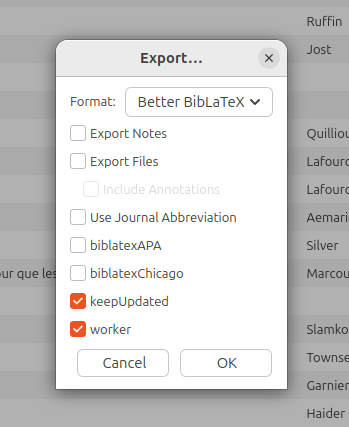


## What do you use as a text editor

for the next step, we assume that the following steps have already been made:

- betterbibtex is active in Zotero, a bibtex was assigned to all your library's items
- you have exported in BibLaTeX format one of your collection to your workspace by keeping it updated (possible for all the LaTeX editors listed below, except for Overleaf if you have only access to a free account)

In order to make things easier to reproduce with the LaTeX IDE of your choice, you may just use the files provided in this repository (mentioned as <a href="texte.tex" download>texte.tex, for the text file</a>) and <a href="biblio.bib" download>biblio.bib for the bib(liography) file</a>.


Which of these tools do you use to compose text with $\LaTeX$?


- [ ] Overleaf
- [ ] Texmaker
- [ ] LaTeX through VSCode editor or VScodium
- [ ] Obsidian 
- [ ] from a CLI (Command Line Interface) 
<script output="tasks">"@input"</script>

<script style="width: 100%">
try {
  let task = @input(`tasks`)

  if(task[0]) {
    send.liascript(`>## Overleaf

  Overleaf is a popular $\LaTeX$ distribution online. You may load the bib file of you collection in your project on Overleaf and then call references with bibtex keys.
  
  try it out with the following files : 
      - <a href="texte.tex" download>tex file</a>
      - <a href="biblio.bib" download>bib file</a>
    load these files in a new project on Overleaf and compile them in order to get a PDF ; does it work?`
  
    )
  } else send.clear()
} catch(e) { }
</script>

<script style="width: 100%">
try {
  let task = @input(`tasks`)

  if(task[1]) {
    send.liascript(`>## TeXmaker

    We assume here that you already have installed on your computer a TeX distribution such as [MikTeX](https://miktex.org/download) or [TeXlive](https://tug.org/texlive/).
    You may also have installed a $\LaTeX$ editor such as TeXstudio or TeXmaker (while it's not necessary, but our example relies on Texmaker). 
    In order to parse references with your editor, you will be asked to install the **biber package**, which can be installed from Aptitude repo (if you use a GNU/Linux system : 
    $ sudo apt install biber). Most recent versions of MiKteX already includes biber.
    Once Biber is installed, you will have to configure your editor so that it can use it: 

    For Texmaker, in Options> Configure TeXmaker > commands, set Bib(la)tex = "/bin/biber" %) (check that biber is in the /bin folder)
    Then in quick compile, select the following workflow : *LaTeX + BibLaTex + LaTeX(x2) + dvips + ps2pdf + see pdf*
    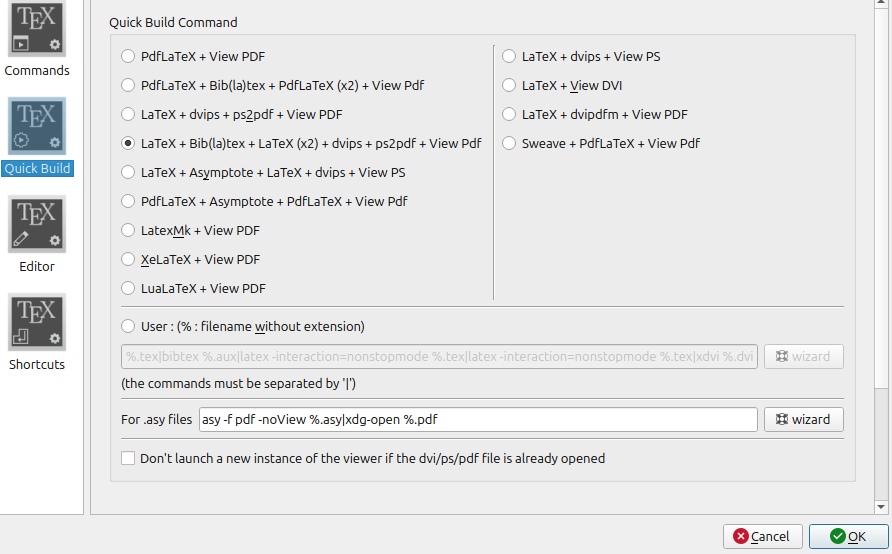
    Try it out with the following files : 
      - <a href="texte.tex" download>tex file</a>
      - <a href="biblio.bib" download>bib file</a>
      load these files in TeXmaker and quick-compile them (type F1) in order to get a PDF ; does it work?`    

    )
  } else send.clear()
} catch(e) { }
</script>


<script style="width: 100%">
try {
  let task = @input(`tasks`)

  if(task[2]) {
    send.liascript(`>## $\LaTeX$ through VSCode or VSCodium
  This works exactly the same for Microsoft VScode editor or its open source counterpart, VScodium. 
  
  > - Install LaTeX extension for VScode/codium (a plugin made by James Yu that was already installed more than 3 millions times)  

  > - Open The palette with Ctrl+maj+P  

  > - Open User_settings.json (type settings and then select the *Open User Settings.json* file to open it)  

  > - in this settings file, copy and paste the content of <a href="settings_latex.json" download>this json file</a>  

  > - Load the <a href="texte.tex" download>texte file</a> and the <a href="biblio.bib>biblio file</a> into your workspace  

  > - open the text file and click on the run (quick compile) icon 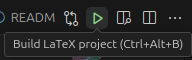  

  you should obtain a texte.pdf with a bibliography correctly parsed.`

    )
  } else send.clear()
} catch(e) { }
</script>

<script style="width: 100%">
try {
  let task = @input(`tasks`)

  if(task[3]) {
    send.liascript(`>## Obsidian
    Obsidian is a notetaking App which includes a markdown editor. 
    Betterbibtex allows you to make a link between a Zotero Collection and your Obsidian vault (the two files are synchronized thanks to BBT's "keep updated" feature)
    You can insert citations into your note with the help of two Obsidian plugins : [Citations](https://github.com/hans/obsidian-citation-plugin), by John Gauthier and [Pandoc Reference List](https://github.com/mgmeyers/obsidian-pandoc-reference-list), by Mathew Meyers.
    Install these two plugins in Obsidian and activate them. 

    ## Citations


  - Choose biblatex as Citation database format  

  - Insert the path to your bib file (absolute path, from Home) ; if the path is good, the numvber of items contained by the bibfile should be displayed.  

  - In your Obsidian vault, create a folder (you may name it for instance 'references')    

  - In Citation plugin settings, put the name of this folder ('references') in the Literature Note folder   

  - You may leave the rest of these options as they are.   

  - Define a shortcut to add add a citation in a note (for instance Ctrl+Maj+E)  

  - Try to add  a reference from your bibfile in one of your note.  


           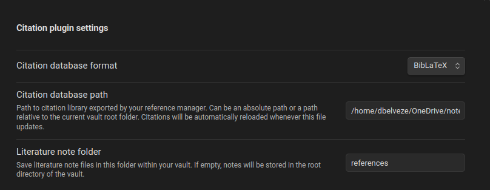 

 ## Pandoc Reference List
    
  To make this plugin work, you need to have [Pandoc](https://pandoc.org/) installed in your system. 

  You need to know where on your operating system Pandoc was downloaded and installed (for example, /usr/bin/pandoc)
  Pandoc will display a formatted reference in Obsidian's sidebar for each pandoc citekey (=bibtex key) in the active document.
    
  - Put the path to your bibfile  

  - Set the Path to Pandoc on your system (see above)  

  - Leave Zotero port as 23119  

  - Choose a citation style in the list menu (you may also add the path to a CSL file as  bibliographic style file)  

  - When you open the note to which you have added a not, you should see the corresponding citations in the editor's right sidebar  

    
        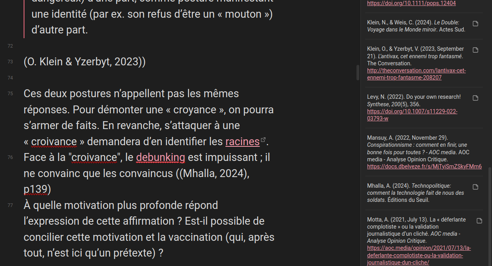
    
    (page number is manualy added, this cannot be managed by Zotero)  `
    
    )
  } else send.clear()
} catch(e) { }
</script>

<script style="width: 100%">
try {
  let task = @input(`tasks`)

  if(task[4]) {
    send.liascript(`>## With Pandoc from Command Line Interface
  
  Install Pandoc on your system. 
  We assume that you already have installed a $\LateX$ distribution (MikTex, TexLive, etc. )
  Go to the [Zotero style gallery](https://www.zotero.org/styles)
  select the style you need (let's say Nature)
  Right-click on style's "source" file and save the file in your workspace, where you have your tex or markdown file and you bibliofile (let's say you wrote a file in markdown)
  Pandoc has no 
  `

    )
  } else send.clear()
} catch(e) { }
</script>